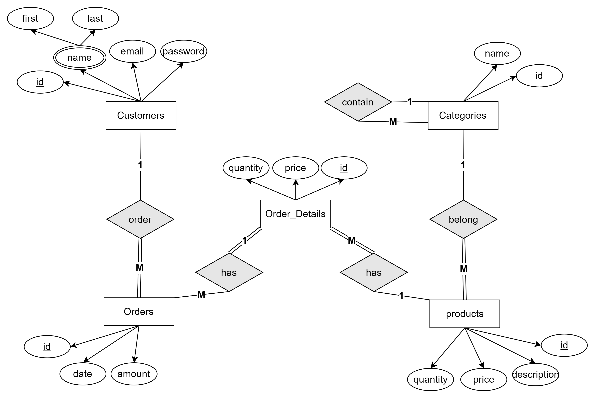
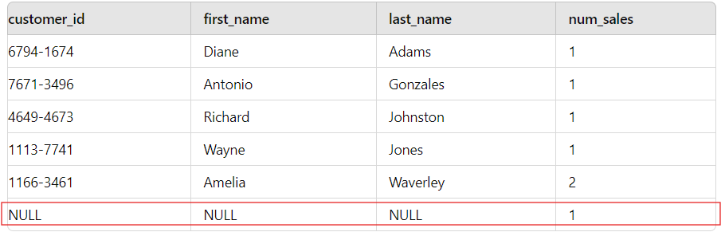

# 📦 E-Commerce-DB
## 1. Introduction
## 2. ERD


## 3. Schema DDL
```sql
CREATE TABLE categories(
category_id SERIAL PRIMARY KEY,
 name VARCHAR(255) NOT NULL
);

CREATE TABLE customers (
 customer_id SERIAL PRIMARY KEY,
 first_name VARCHAR(50) NOT NULL,
 last_name VARCHAR(50) NOT NULL,
 email VARCHAR(100) NOT NULL UNIQUE,
 password VARCHAR(255) NOT NULL
);

CREATE TABLE orders (
 order_id SERIAL PRIMARY KEY,
 customer_id INT,
 order_date TIMESTAMP NOT NULL DEFAULT CURRENT_TIMESTAMP,
 total_amount DECIMAL(10, 2) NOT NULL,
 FOREIGN KEY (customer_id) REFERENCES customers(customer_id)
);

CREATE TABLE products (
  product_id SERIAL PRIMARY KEY,
  category_id INT,
  name VARCHAR(255) NOT NULL,
  description TEXT,
  price DECIMAL(10, 2) NOT NULL,
  stock_quantity INT NOT NULL,
  FOREIGN KEY (category_id) REFERENCES Categories(category_id)
);

CREATE TABLE orderdetails (
  order_detail_id SERIAL PRIMARY KEY,
  order_id INT,
  product_id INT,
  quantity INT NOT NULL,
  unit_price DECIMAL(10, 2) NOT NULL,
  FOREIGN KEY (order_id) REFERENCES orders(order_id),
  FOREIGN KEY (product_id) REFERENCES products(product_id)
);
```


## 4. Denormalization for Performance Improvement  🚀
In our e-commerce system, we encountered a specific case where the volume of read operations for certain attributes—such as customer details, product information, and sales data—was significantly high. To address this, we implemented denormalization to optimize performance.

For example, rather than executing multiple joins across various tables to generate sales history reports, We created a denormalized sale_history table that consolidates these frequently accessed attributes into a single table. This approach reduces the need for complex joins and speeds up data retrieval, particularly for reports and queries that require this specific information.
```sql
CREATE TABLE sale_history (
  customer_id SERIAL PRIMARY KEY,
  first_name VARCHAR(50) NOT NULL,
  last_name VARCHAR(50) NOT NULL,
  email VARCHAR(100) NOT NULL UNIQUE,
  password VARCHAR(255) NOT NULL

  product_id CHAR(8),
  description VARCHAR(50) NOT NULL,
  price NUMERIC(5,2) NOT NULL,
  
  sale_no SMALLINT,
  sale_date DATE NOT NULL,
  quantity INTEGER NOT NULL,
  amount NUMERIC(6,2) NOT NULL,
  
  PRIMARY KEY (sale_no)  -- cutomer_id and product_id can be repeated, but sale_no cannot
);
```

## 4. Null Values and Union Operation
we encountered a situation where retrieving data with null values in the CustomerNo field was problematic. Specifically, including these nulls in the results caused issues with the query output.
Like this query:
```sql
SELECT 
    customers.custumer_id, 
    customers.first_name, 
    customers.last_name, 
    COUNT(*) AS num_sales
FROM sales
LEFT JOIN customers ON sales.custumer_id = customers.custumer_id
GROUP BY customers.custumer_id, customers.first_name, customers.last_name
ORDER BY customers.last_name, customers.first_name;
```


Well, there's no obvious way to eliminate the nulls from the query that we've already got, but what we can do is break the original query into two: 
one that retrieves the sales for "real" customers, and one that retrieves the cash sales(e.g., a walk-in customer). As long as the results of both queries are compatible, we can then use a UNION to combine them into a single result.
```sql
SELECT 
    customers.custumer_id, 
    customers.first_name, 
    customers.last_name, 
    COUNT(*) AS num_sales
FROM sales
LEFT JOIN customers ON sales.custumer_id = customers.custumer_id
GROUP BY customers.custumer_id, customers.first_name, customers.last_name

UNION

SELECT 
    'Cash sale' AS custumer_id,
    'Cash sale' AS first_name,
    'Cash sale' AS last_name,
    COUNT(*) AS num_sales
FROM sales
WHERE sales.custumer_id IS NULL

ORDER BY last_name, first_name;

```


