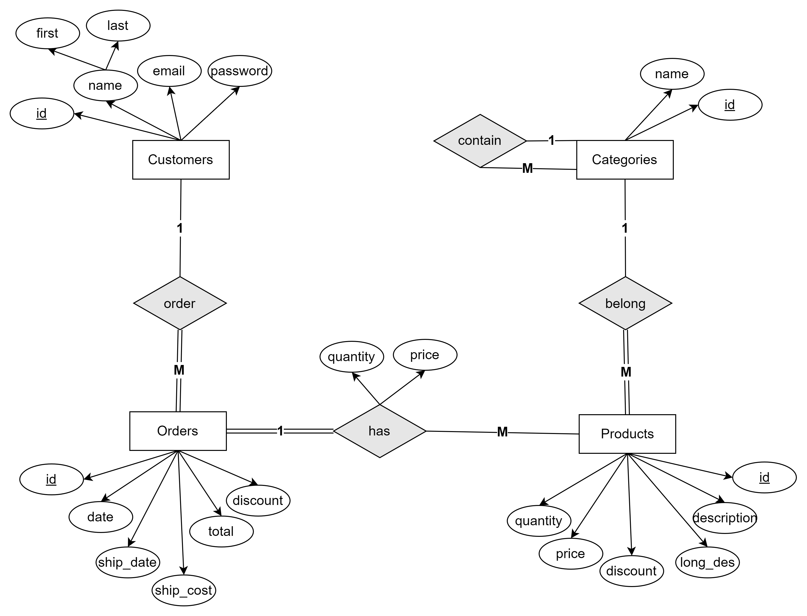
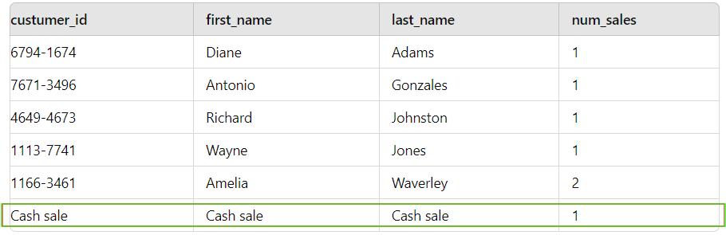

# 📦 E-Commerce-DB
## INDEX
- [1. Introduction](#1-introduction)
- [2. Entity Relationship Diagram](#2-entity-relationship-diagram-)
- [3. Schema DDL](#3-schema-ddl)
- [4. Sample Queries](#4-sample-queries)
  - [4.1 Revenue Report](#41-generate-a-daily-report-of-the-total-revenue-for-a-specific-date)
  - [4.2 Top Selling Report](#42-generate-a-monthly-report-of-the-top-selling-products-in-a-given-month)
  - [4.3 Customers Orders > $500](#43-retrieve-a-list-of-customers-who-have-placed-orders-totaling-more-than-500-in-the-past-month)
  - [4.4 Text Searching](#44-search-for-all-products-with-the-word-camera-in-either-the-product-name-or-description)
  - [4.5 Recommend Products](#45-suggest-popular-products-in-the-same-category-for-the-same-author-excluding-the-purchsed-product-from-the-recommendations)
- [5. Indexing](#5-indexing)
- [6. Challenges Faced](#6-challenges-faced-)
  - [6.1 Handling Recursive Categories](#61-handling-retrieving-recursive-categories)
  - [6.2 High Read Operations - Denormalization](#62-denormalization-for-performance-improvement)
  - [6.3 Null Values and Union Operation](#63-null-values-and-union-operation)
  

## 1. Introduction
This repository provides a detailed framework for developing and optimizing an e-commerce database using PostgreSQL. It includes a variety of SQL queries, database design principles, and strategies for performance enhancement. You'll find insights into indexing techniques, denormalization, and other advanced methods to handle and analyze data efficiently, ensuring your system is robust and scalable.


## 2. Entity Relationship Diagram 📊  
- **Logical ERD**
  
- **Physical ERD**


## 3. Schema Creation
The Schema DDL SQL code can be reviewed in detail in the following document: [Schema DDL](DOCs/Schema%20DDL.txt)
  
### 3.1 Natural Vs Surrogate Primary Key
We made a surrogate primary key in the Product table, using a simple sequential identifier (e.g., product_id).  
#### This choice is suitable due to:  
- **Stability**: Product IDs remain unchanged even if product details are modified.  
- **Simplicity**: A numeric ID simplifies relationships and indexing across tables.  
- **security**:These keys are often non-meaningful (like auto-incrementing numbers), which means they do not expose sensitive information about the data.  
  
### 3.2 Soft Vs Hard Delete 🗑️
We often implement soft delete to preserve data integrity and maintain a record of historical data, which can be critical in many applications. Instead of permanently deleting records, a soft delete involves marking them as deleted using a boolean (e.g., is_deleted) or timestamp (e.g., deleted_at) column.  
#### Pros:
- **Easy recovery**: Restore records by resetting the `is_deleted` flag.
- **Audit trail**: Keeps a history for better traceability(Data Analysis).  
- **Data integrity**: Prevents accidental loss of records.


## 4. Sample Queries
### 4.1 Generate a daily report of the total revenue for a specific date
```sql
SELECT SUM(total_price) AS DailyRevenue
FROM Orders
WHERE DATE(order_date) = '2024-08-01';
```
### 4.2 Generate a monthly report of the top-selling products in a given month
```sql
SELECT 
	 p.product_id,
	 product_name, 
	 SUM(od.product_order_quantity)AS total_quantity_sold
FROM order_detail od
JOIN product p ON p.product_id=od.product_id
JOIN orders o ON o.order_id=od.order_id
WHERE 
    EXTRACT(MONTH FROM o.order_date) = 8
    AND EXTRACT(YEAR FROM o.order_date) = 2024
GROUP BY p.product_id
ORDER BY total_quantity_sold DESC;
```
### 4.3 Retrieve a list of customers who have placed orders totaling more than $500 in the past month
```sql
SELECT 
  	c.customer_id,
	CONCAT(c.first_name,' ',c.last_name) AS customer_name,
	SUM(o.total_price)
FROM customer  c 
JOIN orders o ON o.customer_id=c.customer_id
WHERE o.order_date >= date_trunc('month', current_date - interval '1 month')
    AND o.order_date < date_trunc('month', current_date)
GROUP BY c.customer_id
HAVING SUM(o.total_price) > 500; 
```
### 4.4 Search for all products with the word "camera" in either the product name or description
```sql
SELECT
	product_id,
	product_name,
	description,
	long_description
FROM product  c 
WHERE product_name LIKE '%camera%'
	OR description LIKE '%camera%'
	OR long_description LIKE '%camera%';
```
**🛑 The following query is inefficient due to the use of leading wildcards. The database is unable to effectively utilize indexes.**  
#### 🛠️ Proposed Solutions
| **Solution**                    | **Description**                                                                                                      | **Pros**                                                        | **Cons**                                                                       |
|----------------------------------|----------------------------------------------------------------------------------------------------------------------|-----------------------------------------------------------------|--------------------------------------------------------------------------------|
| **1. Limiting Leading Wildcards**| Use regular indexes and avoid leading wildcards by restructuring queries (camera%).                                             | **Index-Friendly**: Works efficiently with indexes in any database.  | **Less flexible**: Can't search for terms in the middle of strings (%camera%).            |
| **2. Full-Text Search**          | Use `MATCH` and `AGAINST` operators for full-text search on indexed columns.                                          | **Efficient for large text**: Enhances performance for large text searches. | **Limited availability**: Not supported by all databases.     |

### 4.5 Suggest popular products in the same category for the same author, excluding the purchsed product from the recommendations
```sql
SELECT 
	 p.product_id,
	 product_name, 
	 description,
	 product_price,
	 COUNT(*) sales_count  -- instead add sales_count as a column in product table
FROM product p
JOIN order_detail od ON p.product_id = od.product_id 
WHERE category_id = (SELECT category_id FROM product WHERE product_id = 1)  
	AND p.product_id != 1    -- 1 is the purchased product for example
GROUP BY p.product_id
ORDER BY sales_count DESC
LIMIT 5;
```


## 5. Indexing
There are two types of index :  
| **Index Type**         | **Pros**                                                      | **Cons**                                                  | **Time Complexity**            | **Example**                                                                                                     |
|------------------------|--------------------------------------------------------------|-----------------------------------------------------------|--------------------------------|-----------------------------------------------------------------------------------------------------------------|
| **Clustered Index**     | Fast data retrieval, maintains data in sorted order, ideal for range queries. | Only one per table, can slow down insert/update operations due to data rearrangement. | O(log n) for retrieval, O(n) for insert/update due to **rearrangement**. |➡️ The `order_id` primary key in the `orders` table can be set as a clustered index, allowing quick retrieval of order data, such as fetching details about an Order for a Kitchen Appliance.  ➡️ For range queries, such as retrieving products priced between `$100` and `$200`, it efficiently scans through the sorted data. |
| **Non-Clustered Index** | Multiple indexes per table, improves retrieval performance for various queries. | Requires additional storage, slower access due to pointer lookups. | O(log n) for retrieval, O(n) for insert/update due to **additional pointers**. | ➡️ Creating a non-clustered index on the `email` column in the `customer` table allows fast lookup of customers during authentication or when sending marketing emails. |

While primary key indexing is automatic, effective indexing should be query-driven. In many cases, it may be more beneficial to create indexes on other columns, such as foreign keys or frequently queried normal columns, rather than relying solely on primary key indexing. This ensures that we are optimizing our database for actual use cases.  
**🛑 Excessive indexing can lead to unnecessary consumption of disk space and could degrade performance during write operations (inserts, updates, and deletes).**   
  
**Indexing on Foreign Keys**  
➡️ In a sales table where customer_id references the customers table, indexing customer_id allows faster retrieval of sales records for specific customers. For instance, if John Doe is a frequent buyer with customer_id = 202, the index helps quickly retrieve his purchase history.  
  
**Indexing Composite Keys**    
➡️ In our e-commerce system, we have a composite key for Order_Details, which consists of (order_id, product_id). By default, the DBMS only indexes order_id. However, since we often query product_id (e.g., to retrieve the top-selling products or product-specific order details), we have added a secondary index on product_id to optimize those queries.


# 6. Challenges Faced 🤔
## 6.1 Handling Retrieving Recursive Categories 
In our e-commerce system, categories can have multiple levels of subcategories, forming a hierarchical tree structure.➡️ For example:  
  
**Clothes**    
├── **Shoes** 👟    
│   ├── Sport Shoes  
│   │   └── Half Neck Sport Shoes  
│   └── Casual Shoes  
├── **Accessories** 🎒    
    └── Belts  
      
Managing and retrieving this hierarchical data efficiently is crucial for providing a seamless user experience. Below are the solutions we considered to handle this recursive relationship.
#### 🛠️ Proposed Solutions

| Solution                                          | Description                                                                                         | Pros                                                       | Cons                                                          |
|---------------------------------------------------|-----------------------------------------------------------------------------------------------------|------------------------------------------------------------|---------------------------------------------------------------|
| **1. Application-Level Solution: On-Demand API Calls** | When a user clicks on a category, the application makes an API request to fetch its immediate subcategories dynamically. | **Dynamic Data Loading**: Fetches only the necessary data when needed, optimizing initial load times. | **Increased API Calls**: May lead to multiple requests, increasing latency. |
| **2. Database-Level Solution: Denormalization with JSON Subcategories** | Create a new table that stores categories with their subcategories in a JSON field. | **Single Query Retrieval**: Fetch entire category tree in one database call. | **Data Redundancy**: JSON may duplicate data, leading to inconsistencies. |


## 6.2 Denormalization for Performance Improvement  
In our e-commerce system, we encountered a specific case where the volume of read operations for certain attributes—such as customer details, product information, and sales data—was significantly high. To address this, we implemented denormalization to optimize performance.

➡️ For example, rather than executing multiple joins across various tables to generate sales history reports, We created a denormalized sale_history table that consolidates these frequently accessed attributes into a single table. This approach reduces the need for complex joins and speeds up data retrieval, particularly for reports and queries that require this specific information.
```sql
CREATE TABLE sale_history (
  customer_id SERIAL PRIMARY KEY,
  first_name VARCHAR(50) NOT NULL,
  last_name VARCHAR(50) NOT NULL,
  email VARCHAR(100) NOT NULL UNIQUE,
  password VARCHAR(255) NOT NULL

  product_id CHAR(8),
  description VARCHAR(50) NOT NULL,
  price NUMERIC(5,2) NOT NULL,
  
  sale_no SMALLINT,
  sale_date DATE NOT NULL,
  quantity INTEGER NOT NULL,
  amount NUMERIC(6,2) NOT NULL,
  
  PRIMARY KEY (sale_no)  -- cutomer_id and product_id can be repeated, but sale_no cannot
);
```

## 6.3 Null Values and Union Operation
we encountered a situation where retrieving data with null values in the CustomerNo field was problematic. Specifically, including these nulls in the results caused issues with the query output.
Like this query:
```sql
SELECT 
    customers.custumer_id, 
    customers.first_name, 
    customers.last_name, 
    COUNT(*) AS num_sales
FROM sales
LEFT JOIN customers ON sales.custumer_id = customers.custumer_id
GROUP BY customers.custumer_id, customers.first_name, customers.last_name
ORDER BY customers.last_name, customers.first_name;
```


Well, there's no obvious way to eliminate the nulls from the query that we've already got, but what we can do is break the original query into two: 
one that retrieves the sales for "real" customers, and one that retrieves the cash sales(e.g., a walk-in customer). As long as the results of both queries are compatible, we can then use a UNION to combine them into a single result.
```sql
SELECT 
    customers.custumer_id, 
    customers.first_name, 
    customers.last_name, 
    COUNT(*) AS num_sales
FROM sales
LEFT JOIN customers ON sales.custumer_id = customers.custumer_id
GROUP BY customers.custumer_id, customers.first_name, customers.last_name

UNION

SELECT 
    'Cash sale' AS custumer_id,
    'Cash sale' AS first_name,
    'Cash sale' AS last_name,
    COUNT(*) AS num_sales
FROM sales
WHERE sales.custumer_id IS NULL

ORDER BY last_name, first_name;

```



## SubQueries
In complex database systems, certain queries require fetching data based on the result of other queries.  
➡️ For example:  
A scenarion where a user selects multiple categories (e.g., "Hiking Boots," "Hooded Sweats," "College Teams") to filter the displayed products
```sql
SELECT p.product_id, p.product_name, p.product_price
FROM product p
WHERE p.category_id IN (
    SELECT c.category_id
    FROM category c
    WHERE c.category_name IN ('Hiking Boots', 'Hooded Sweats', 'College Teams')
);
```
**🛑 These subqueries can enhance the flexibility of data retrieval but also introduce performance challenges:** 
  
➡️ Imagine the scenario that we want to identify products that are priced above the average price of products within their respective categories. This can help in determining premium products for promotional strategies.
```sql
SELECT p.product_id, p.product_name, p.product_price
FROM product p
WHERE p.product_price > (
    SELECT AVG(p2.product_price)
    FROM product p2
    WHERE p2.category_id = p.category_id
);
```
**🛑 The inner query is executed for each row returned by the outer query (Correlated Subquery) which is performance challange.**


## View
➡️ We want to generate a sales report that summarizes customer purchases over the past month. The report should include customer names, total sales amounts, and the number of purchases for each customer.
**Challenge:** The sales data is spread across multiple tables: orders, order_detail, and customer. Creating this report requires complex joins and aggregations that would be cumbersome for end-users who need to access this information frequently.
**Solution:** Create a view that encapsulates the logic required to generate this report.
```sql
CREATE VIEW customer_sales_report AS
SELECT 
    c.customer_id,
    CONCAT(c.first_name, ' ', c.last_name) AS customer_name,
    SUM(od.product_order_quantity * od.unit_price) AS total_sales,
    COUNT(o.order_id) AS total_orders
FROM customer c
JOIN orders o ON c.customer_id = o.customer_id
JOIN order_detail od ON o.order_id = od.order_id
WHERE o.order_date >= date_trunc('month', current_date - interval '1 month')
GROUP BY c.customer_id
ORDER BY total_sales DESC;
```
**🛑 Although views offer significant benefits in terms of simplifying complex queries, enhancing security(Access Levels), and ensuring consistency in reporting, they also come with drawbacks related to functionality, and maintenance,Views can become stale if underlying data changes(Static View)**


## Stored Procedure
➡️ When a customer places an order, multiple operations need to be executed, such as updating inventory, calculating total prices, applying discounts, and creating records in the orders and order details tables.  
A stored procedure can encapsulate all these steps into a single transaction, ensuring that either all changes are committed or none are, preserving data integrity.
#### pros:  
- Stored procedures are precompiled, which can improve execution speed than a normal query.
- Can help enhance security by restricting direct access to tables.
```sql
CREATE PROCEDURE ProcessOrder(
    IN p_customer_id INT,
    IN p_product_id INT,
    IN p_quantity INT,
    OUT p_order_id INT
)
BEGIN
    DECLARE v_total_price DECIMAL(10, 2);
    
    -- Calculate total price
    SELECT price INTO v_total_price FROM product WHERE product_id = p_product_id;
    SET v_total_price = v_total_price * p_quantity;

    -- Insert order
    INSERT INTO orders (customer_id, order_date, total_price)
    VALUES (p_customer_id, NOW(), v_total_price);
    SET p_order_id = LAST_INSERT_ID();

    -- Update inventory
    UPDATE product SET stock = stock - p_quantity WHERE product_id = p_product_id;
END;
```


## Trigger
➡️ When an order is deleted from the orders table (perhaps due to cancellation), you might want to automatically delete the related rows in the order_detail table to avoid orphaned records. This ensures that when an order is removed, all its associated details are also removed which using of trigger comes(After Trigger), keeping the data consistent.
```sql
CREATE TRIGGER DeleteOrderDetailsAfterOrderDelete
AFTER DELETE ON orders
FOR EACH ROW
BEGIN
    DELETE FROM order_detail WHERE order_id = OLD.order_id;
END;
```
**🛑 But they can become dangerous if not carefully managed like **cascading triggers** causes innfinite loops.**
